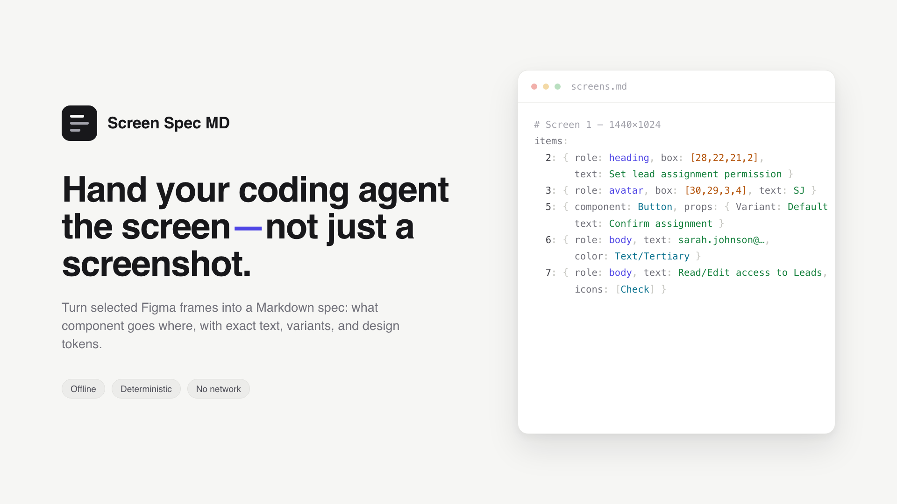

# Screen Spec MD

A Figma plugin that turns selected frames into a **Markdown screen spec** — a compact YAML list
where every UI element carries its role (or repo component name), its position, exact text,
variant props, icons, and optionally color — for pasting into an LLM coding agent **alongside a
screenshot**.

[](https://www.figma.com/community/plugin/1642215897646749039/screen-spec-md)

**[Get Screen Spec MD on Figma Community →](https://www.figma.com/community/plugin/1642215897646749039/screen-spec-md)**

The idea: hand your coding agent the screenshot for the *picture*, and this spec for everything
pixels can't show — *which* component goes *where*, its variant, the exact copy, the layout
intent, and (optionally) the design token behind a color. The two together let an agent compose
your existing components into the screen.

## How it works

The plugin reads the **layer tree** directly (not a rendered image), so text is exact and
nothing is OCR-guessed. For each selected frame it walks the nodes into a flat list of
positioned elements and emits one `## Screen N` block:

- **Position** — every item gets `box: [x, y, w, h]` as integer **% of the frame**, so a name
  pins onto a spot in the accompanying screenshot (resolution-independent).
- **Roles inferred from properties** (never layer names) — heading / body / eyebrow / caption,
  `button-primary`/`button-secondary`, `badge`, `input`, `avatar`, `image`, `icon`, `chart`.
- **Component instances** are tagged with their repo component name and **variant props**
  (e.g. `{ Size: Small, State: Default }`), plus an inline **icon** inventory.
- **Layout intent** for auto-layout containers (`row gap 16 between align center`).
- **Color** (optional, off by default) — a bound **variable/style token** name, or a **raw hex**
  fallback when no token is mapped.

Noise is collapsed the way a reader would summarize it: a chart's gridlines/series become one
`chart`; a repeating-row **table** becomes one element with `columns` + row `cells` + `rows`; a
row of stat **cards** and a **tabs** control each collapse to one item; an icon and its adjacent
label merge into a single item. Hidden / zero-opacity / decorative nodes (cursors, scrollbars)
are dropped, and the screen's default text color is omitted (only color *deviations* are kept).

It's fully **offline and deterministic** — no canvas, no OCR, no network
(`networkAccess: ["none"]`).

### Example output

```yaml
## Screen 1 — 1440×1024

# box: [x, y, w, h] in % of frame
items:
  1: { component: Sidebar, box: [0, 0, 4, 100], props: { Collapsed: true }, icons: [Chats, Projects, Code] }
  2: { role: heading, box: [28, 22, 21, 2], text: Set lead assignment permission }
  3: { role: avatar, box: [30, 29, 3, 4], text: SJ }
  4: { role: body, box: [33, 30, 14, 2], text: "sarah.johnson@company.com", color: Text/Tertiary }
  5: { component: Button, box: [62, 29, 12, 4], props: { Variant: Default }, text: Confirm assignment }
  6: { role: body, box: [30, 40, 12, 2], text: Read/Edit access to Leads, icons: [Check] }
```

Output is one combined `screens.md` (a `## Screen N` block per selected frame), shown in a
copyable preview and downloadable from the UI. A **Colors** toggle (Off / Tokens / Hex) controls
color extraction. In Dev Mode, the same Markdown is also available as a plain-text result in the
Code section.

## Develop

Built with [Create Figma Plugin](https://yuanqing.github.io/create-figma-plugin/).
Use Node.js 22–24.

```
$ npm run build      # generates manifest.json + build/
$ npm run watch      # rebuild on change
```

Load it: in the Figma desktop app, run **Import plugin from manifest…** (Quick Actions) and
pick the generated `manifest.json`. In design mode, select one or more frames or sections, run the
plugin, pick a color mode if you want, and click **Create screens.md**. In Dev Mode, open it from the
Inspect / Plugins panel for the same UI, or select a supported screen container in the Code
section to get Markdown directly.

Check the formatting offline (no Figma needed) — feeds sample `ScreenData` through the renderer:

```
$ npx --yes tsx scripts/selftest.ts
```

### Source layout

- [`src/main.ts`](src/main.ts) — Figma side: selection/codegen node → `extractScreen` per frame
  → emit or return Markdown.
- [`src/lib/extract.ts`](src/lib/extract.ts) — layer tree → flat `Element[]` with `% boxes`
  (role inference, component/variant/icon capture, chart/table/cards/tabs collapse, icon-label
  pairing, color-token resolution, de-noising).
- [`src/lib/outline.ts`](src/lib/outline.ts) — assembles the combined Markdown (the YAML
  `items` list per screen).
- [`src/ui.tsx`](src/ui.tsx) — UI: color toggle → Generate → preview + `screens.md` download.
- [`src/types.ts`](src/types.ts) — shared `Role` / `ColorMode` / `Element` / `Box` / `ScreenData`
  types.

## Contributing and license

Contributions are welcome—please read [CONTRIBUTING.md](CONTRIBUTING.md) before opening a pull
request. This project is released under the [MIT License](LICENSE).
